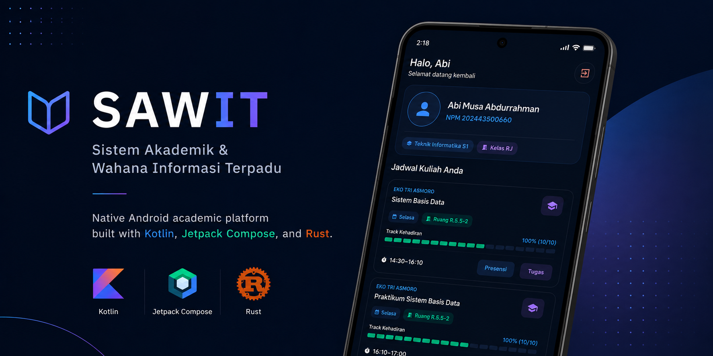

##

Aplikasi Android native berbasis Jetpack Compose dengan modul backend berbasis **Rust** untuk membantu mahasiswa mengakses **SAWIT (Sistem Akademik & Wahana Informasi Terpadu)** langsung dari perangkat mobile. Proyek ini menangani autentikasi ke portal `lms.unindra.ac.id`, bypass captcha secara lokal, manajemen session, serta scraping data akademik dengan performa tinggi dan parsing HTML yang tangguh di sisi Rust.

## Fitur Utama

- **Login Otomatis**: Masuk ke SAWIT menggunakan NIM dan password.
- **Enkripsi Kredensial**: Auto-login aman menggunakan kredensial yang disimpan lokal dengan enkripsi AES-256 GCM (Google Tink).
- **OCR Captcha Solver**: Pemecahan captcha matematika otomatis secara lokal menggunakan library OCR (`ocr-rs` & `image` di sisi Rust) tanpa API pihak ketiga.
- **Dashboard Akademik**: Menampilkan profil mahasiswa, daftar mata kuliah aktif, dan rekap presensi dari SAWIT.
- **Detail Pertemuan**: Menampilkan sesi pertemuan, deskripsi, serta tautan aktivitas per mata kuliah.
- **Unduh Materi**: Mendownload file kuliah ke folder publik `Downloads/sawit` disertai notification progress bar secara real-time.
- **Unggah Tugas**: Mengunggah file tugas kuliah dari file picker langsung ke server melalui multipart stream.
- **Sinkronisasi Cepat**: Fitur pull-to-refresh dengan indikator sinkronisasi data global yang mutakhir.
- **UI Modern Premium**: Desain antarmuka modern dengan efek glassmorphic (Haze) dan mikro-animasi bouncy scale.

## Stack Teknologi

Proyek ini dibangun menggunakan arsitektur hybrid **Android Kotlin (UI)** dan **Rust (Business Logic)** untuk menjamin kecepatan parsing data dan modularitas kode yang optimal.

### 1. Android Frontend (Kotlin & Compose)
- **UI Framework**: Jetpack Compose, Material 3, Haze (Glassmorphism effects)
- **Navigasi**: Navigation 3 (AndroidX)
- **Local Cache**: Room Database (menyimpan cache mata kuliah, pertemuan, tugas, dan kehadiran untuk akses offline)
- **Storage**: DataStore Preferences
- **Keamanan**: Google Tink (AES-256 GCM untuk enkripsi kredensial lokal)
- **Dependency Injection**: Koin
- **Image Loading**: Coil (mendukung format gambar dan GIF)
- **JNI Interop**: Memanfaatkan berkas bindings hasil generasi UniFFI untuk memanggil fungsi native Rust via standar JNI (Java Native Interface)

### 2. Rust Backend (`lms-rust`)
- **Networking**: `reqwest` (mendukung cookie persistence untuk menjaga session, form data, dan multipart stream uploads)
- **HTML Scraping**: `scraper` (CSS Selectors parser untuk scraping DOM HTML lms.unindra.ac.id secara efisien)
- **OCR Engine**: `ocr-rs` & `image` (memecahkan captcha matematika langsung di level native)
- **Async Runtime**: `tokio` (multi-threaded executor di sisi Rust) & `futures`
- **JNI Bindings**: `UniFFI` (generasi boilerplate interface Kotlin-Rust secara otomatis)

## Struktur Proyek

```text
.
├── app/                     # Modul Android (Kotlin/Compose UI)
│   ├── src/main/jniLibs/    # Shared library .so hasil build Rust (x86_64, arm64-v8a)
│   ├── src/main/kotlin/     # Source code Kotlin & file bindings UniFFI (com/gaje48/lms/)
│   └── src/main/res/        # Resource XML (Tema, Icon, Layout)
├── lms-rust/                # Modul Rust (Scraping, HTTP reqwest, OCR solver)
│   ├── src/                 # Source code Rust (lib.rs & generator uniffi-bindgen)
│   ├── Cargo.toml           # Konfigurasi dependensi crate Rust
│   └── build_andro.sh       # Bash script untuk cross-compile Rust & generate bindings Kotlin
├── gradle/
├── build.gradle.kts
├── settings.gradle.kts
└── gradlew
```

## Alur Kerja Aplikasi

1. **Inisialisasi**: Aplikasi memeriksa status login via DataStore dan mendekripsi kredensial pengguna menggunakan Google Tink.
2. **Login & Captcha**: Rust Backend meminta halaman login `lms.unindra.ac.id`, mengambil gambar captcha, menyelesaikannya melalui model OCR lokal, dan mengirimkan post request autentikasi ke server.
3. **Scraping Data**: Setelah session terbentuk, modul Rust mem-parsing struktur HTML dashboard untuk mengekstrak profil mahasiswa, kelas aktif, materi, dan jadwal deadline tugas.
4. **Penyimpanan Lokal**: Data hasil scraping di-commit ke Room DB agar pengguna dapat tetap melihat jadwal dan materi secara responsif meski offline.
5. **Download/Upload**: Proses unduh materi dan unggah tugas diproses di level Rust, lalu mengirimkan progress update secara berkala melalui callback stream ke UI Jetpack Compose.

## Persyaratan Sistem

- **Android Studio** versi terbaru (dengan AGP 9.2+)
- **JDK 17**
- **Rust Toolchain** (stable terbaru)
- **Target Android NDK**: `rustup target add x86_64-linux-android aarch64-linux-android`
- **NDK Compiler**: Android NDK dan tool `cargo-ndk` (`cargo install cargo-ndk`)
- Perangkat Android dengan **minimum SDK 29** (Android 10)

## Cara Menjalankan Proyek

### 1. Clone Repository
```bash
git clone <url-repository>
cd lms-unindra
```

### 2. Build Rust Library
Sebelum membuka proyek di Android Studio, Anda wajib melakukan cross-compile modul Rust untuk men-generate binary `.so` dan file bindings Kotlin:
```bash
cd lms-rust
chmod +x build_andro.sh
./build_andro.sh
cd ..
```
*Script ini akan menghasilkan file `.so` di `app/src/main/jniLibs` dan binding Kotlin di `app/src/main/kotlin/uniffi/lms_rust/lms_rust.kt`.*

### 3. Jalankan Aplikasi
- Buka folder proyek utama (`lms-unindra`) di Android Studio.
- Jalankan Gradle Sync.
- Hubungkan device/emulator lalu klik **Run** atau jalankan perintah berikut lewat terminal:
```bash
./gradlew installDebug
```

## Build APK

Untuk membuat build debug APK:
```bash
./gradlew assembleDebug
```

Untuk membuat build release APK:
```bash
./gradlew assembleRelease
```

File APK hasil build dapat ditemukan di folder:
```text
app/build/outputs/apk/
```

## Perizinan (Permissions) yang Diperlukan

- **INTERNET**: Berkomunikasi langsung dengan server LMS Unindra (`lms.unindra.ac.id`).
- **POST_NOTIFICATIONS**: Menampilkan progres unduhan materi kuliah dan unggahan tugas kuliah di Android 13+.
- **SCHEDULE_EXACT_ALARM**: Memastikan sinkronisasi background berkala untuk mengecek tugas baru berjalan tepat waktu.

## Catatan Penting Implementasi

- **Cookie Management**: Sesi login dipertahankan di level library Rust menggunakan fitur Cookie Store bawaan `reqwest`.
- **Captcha Retry**: Akan mencoba memecahkan captcha secara otomatis hingga berhasil login. Jika gagal, akan menampilkan pesan error.
- **Lokasi Unduhan**: Pengunduhan materi diarahkan langsung ke folder publik `Downloads/sawit` pada penyimpanan internal perangkat Android.
- **Risiko Scraping**: Karena aplikasi ini menggunakan pendekatan scraping HTML (DOM parsing), perubahan struktur visual atau pembaruan sistem pada situs resmi `lms.unindra.ac.id` sewaktu-waktu dapat memengaruhi fungsionalitas parser pada modul Rust.

## Disclaimer

Proyek ini dibuat untuk mempermudah mahasiswa dalam mengakses portal `lms.unindra.ac.id` secara praktis di smartphone dan **bukan merupakan aplikasi resmi** dari pihak Universitas Indraprasta PGRI. Pengguna bertanggung jawab penuh atas kredensial yang disimpan di dalam perangkat masing-masing.